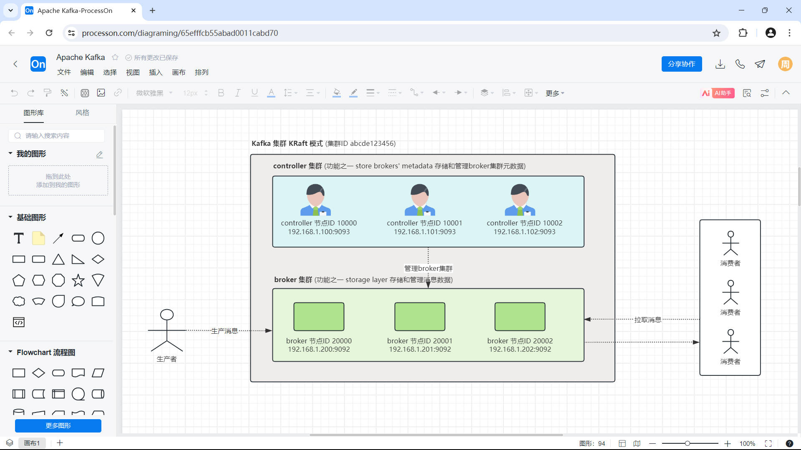
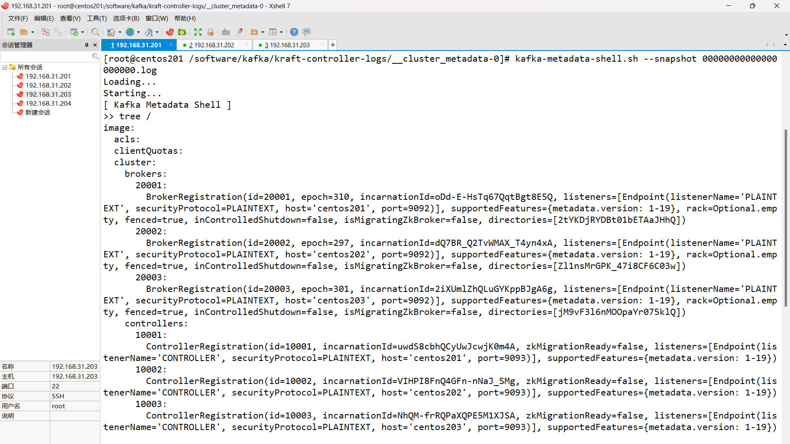
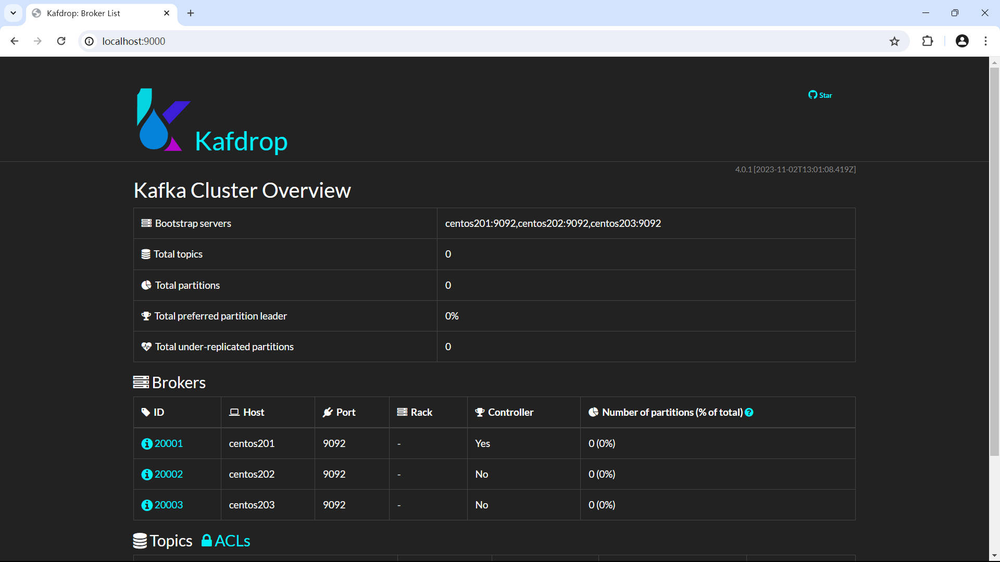
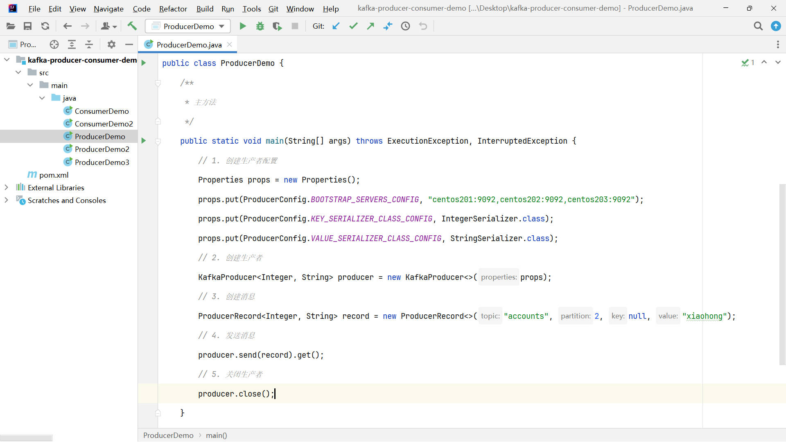
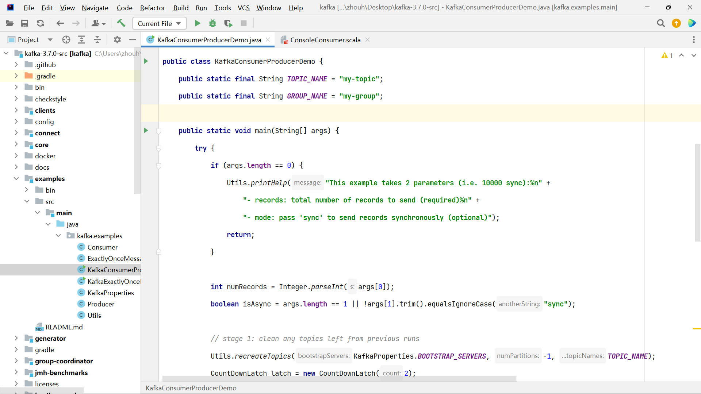

# Kafka 消息队列 (KRaft模式)

## 课程介绍 

本课程使用官网文档、源码、物理文件分析等方式带大家入门 KRaft 模式的 Apache Kafka。

Kafka 是一个消息队列，也称作事件流平台、消息系统、消息中间件、消息引擎、消息发布订阅系统等。

本课程主要内容为：

1. 环境搭建
   - 介绍 Apache Kafka
   - 下载安装 JDK
   - 下载安装 Kafka
   - 修改 PATH 环境变量
2. 单台机器集群(KRaft)[1]
   - 介绍 Kafka 的 KRaft 模式
   - 介绍 controller 和 broker
   - 修改 controller 和 broker 配置
3. 单台机器集群(KRaft)[2]
   - 使用 kafka-storage.sh 格式化数据目录
   - 启动 controller，并分析启动日志
   - 启动 broker，并分析启动日志
   - 使用 kafka-metadata-shell.sh 分析集群元数据
4. Broker配置补充
   - 补充 listeners、advertised.listeners 等配置
   - 使用 kafka-metadata-shell.sh 验证配置修改
   - 配置支持内网、外网访问的 broker 配置
   - 使用 kafka-console-producer.sh 验证配置修改
5. 集群测试
   - 介绍消息主题 topic
   - 使用 kafka-topics.sh 创建主题
   - 使用 kafka-metadata-shell.sh 分析元数据
   - 使用 kafka-console-producer.sh 生产消息
   - 使用 kafka-console-consumer.sh 消费消息
   - 分析 broker 消息数据文件
6. 可视化工具
   - 介绍 Kafdrop
   - 下载、安装、运行 Kafdrop
   - 创建主题、删除主题、查看消息数据等
   - 介绍 Kafka 主题删除过程
7. 三台机器集群(KRaft)
   - 配置 controller 和 broker
   - 格式化数据目录
   - 启动 controller 和 broker，并分析启动日志
   - 分析集群元数据
   - 关闭 controller 和 broker
8. 主题 分区 副本
   - 介绍主题 topic
   - 介绍分区 partition
   - 介绍副本 replica，介绍 leader follower
   - 分析 broker 数据文件
   - 分析主题、分区、副本相关的集群元数据
   - 使用 Java 代码指定分区生产消息
9. 生产者
   - 分析生产者配置 
   - 分析 Kafka 源码 KafkaConsumerProducerDemo 中的生产者代码
   - 使用 Java 代码生产消息，实现消息同步发送、异步发送
   - 分析消息顺序问题 
   - 分析生产者序列化器 StringSerializer、分区器等源码
10. 消费者消费者组
    - 介绍消费者配置
    - 分析 Kafka 源码 KafkaConsumerProducerDemo 中的消费者代码
    - 使用 Java 代码消费消息
    - 介绍并演示消费者组 consumer group
    - 介绍并演示消费者再平衡过程 consumer rebalance
    - 介绍并演示自动重置消费位移
    - 分析消费者反序列化器 StringDeserializer、控制台消费者 kafka.tools.ConsoleConsumer 等源码

## 相关截图

## 备注

课程代码等内容，在课程资料里面。